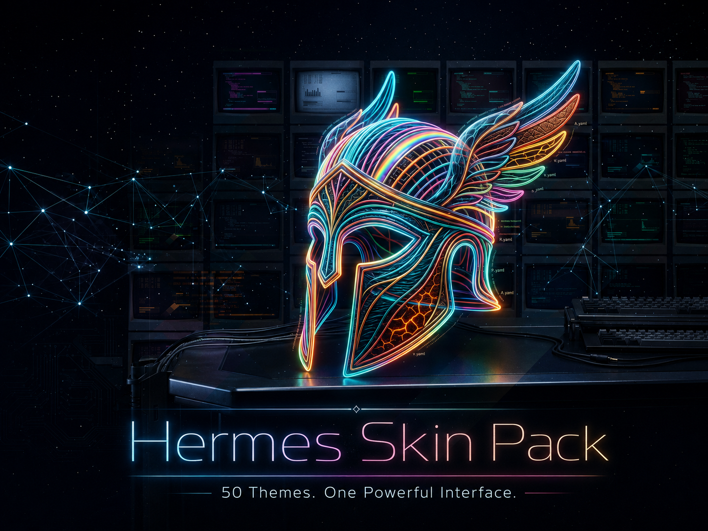

# Hermes Skins Pack — 50 Subscriber Themes



A curated pack of **50 unique, drop-in skin themes** for the [Hermes Agent](https://github.com/NousResearch/hermes-agent) CLI and TUI. Every skin is a complete YAML file using the real Hermes color keys — no inherited defaults, no silent fallbacks.

## What's Inside

| Category | Skins |
|---|---|
| Cyberpunk / Synthwave | neon-ghost, chrome-rain, glitch-punk, void-sunset, netrunner |
| Modern Dark / OLED | obsidian, deep-void, graphite, midnight-studio, eclipse |
| Earth & Nature | redwood, sandstone, deep-ocean, moss-stone, aurora-boreal |
| Retro / Vintage | amber-terminal, green-screen, typewriter-cream, commodore-64, newsprint-noir |
| Monochromatic / Minimalist | bone-white, slate-mist, warm-ash, steel-thread, single-malt |
| High Contrast | white-flash, solar-flare, black-canary, red-alert, high-noon |
| Pastel / Soft | lavender-dream, peach-fuzz, seafoam-silk, dusty-rose, baby-blue |
| Light / Paper Modes | warm-parchment, rice-paper, blueprint, linen-sage, alabaster |
| Fantasy / Gaming | dragon-blood, arcane-tome, shadow-thief, enchanted-forest, forge-master |
| Abstract / Artistic | vaporwave-mall, brutalist-concrete, stained-glass, desert-neon, liquid-silver |

## Install the Pack

Download and unzip the release, then run:

```bash
cd hermes-skins-pack
./install.sh
```

The installer requires Python 3, which Hermes already uses. It copies all 50 YAML files into `${HERMES_HOME:-$HOME/.hermes}/skins/` and leaves any skin you already customized untouched.

Switch skins inside Hermes with `/skin <name>`, or set one as the default:

```bash
hermes config set display.skin neon-ghost
```

To install one skin by hand:

```bash
mkdir -p ~/.hermes/skins
cp skins/neon-ghost.yaml ~/.hermes/skins/
```

## Package Contents

- `skins/`, 50 ready-to-use YAML skin files
- `install.sh`, safe installer that preserves existing files
- `hermes_50_skins_pack.md`, browsable catalog with every full YAML block
- `VERSION`, package version used in the ZIP filename
- `LICENSE`, MIT license

Every skin defines the complete current Hermes palette, including syntax colors and `shell_dollar`, so it does not silently inherit the default theme.

## Build and Verify

Development checks require [`uv`](https://docs.astral.sh/uv/). The package builder itself uses only Python's standard library.

```bash
make test
make package
```

The package command creates `dist/hermes-skins-pack-v<version>.zip`.

## License

MIT. Do whatever you want with these.

Made by @BChopLXXXII

Built for vibe coders who just want their AI to feel less... corporate.

Ship it. 🚀

If this helped, ⭐ the repo — it helps others find it.